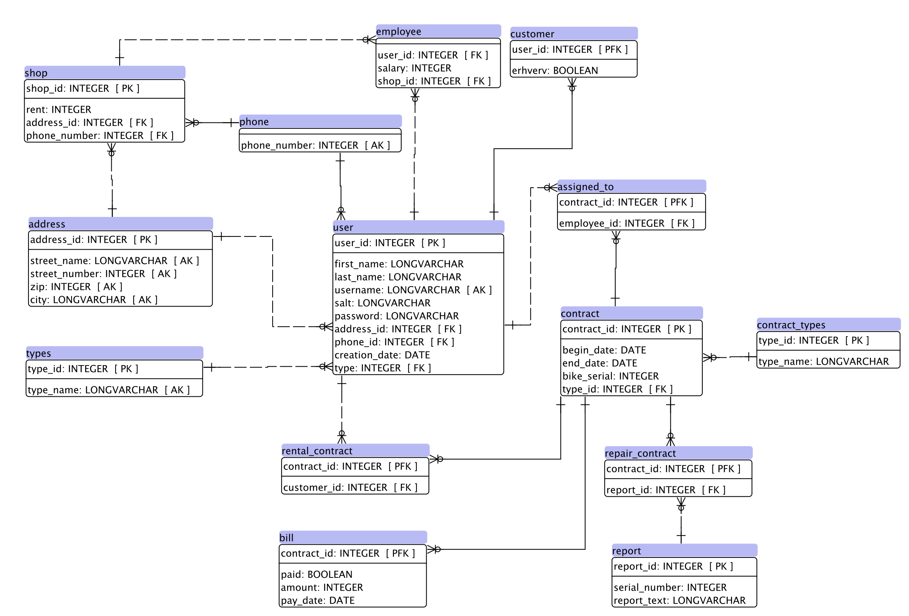

Design
======

   *Entity relationship diagram of the bike rental database*

The database is designed around the users. Different users create contracts between eachother regarding bikes.

The users are the central aspect and they are represented by a base user table with an attribute telling their type.
A table exist for customer specific attributes as well as employee specific attributes. Each have the users.user_id foreign key as their primary key.

The contracts are the glue between users and bikes.
At least two kinds of contracts can exist, the rental and the repair contract. All contracts hold the same info and the ability to add a report, could be a repair report. A contract has an attribute telling which type it is. This can be used to discriminate from an application on which users can access which kinds of contracts.

The *contracts.assigned_to* table tells of which users are assigned to which contracts. All contracts has to be assigned an employee but only *rental_contracts* require a customer. The design is flexible enough to allow for new kinds of contracts to be introduced as the *contract_types* table functions as a lookup table to figure out which other table you should look in to find additional information regarding a custom contract.

A bike is conceptualized as a combination between a unique serial number and some type specific details.
I decided to place the details in their own table, since they can be shared by many bikes, and use the serial number as the primary key.

.. raw:: pdf

   PageBreak